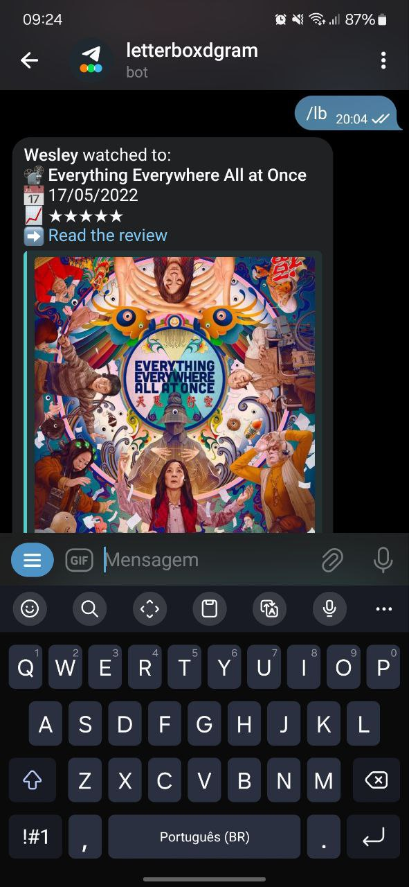
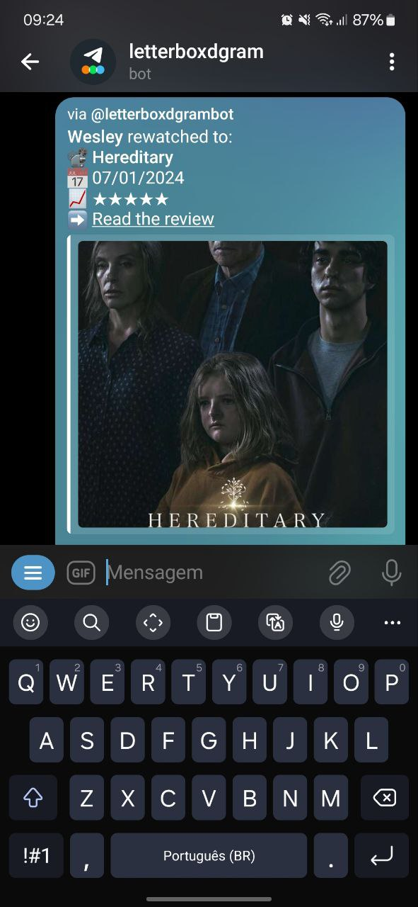

<header>
  
  <h1 style="display: inline">letterboxdgram</h1>

  Telegram bot that shares your movie-watching activity.

  
</header>

## About

Letterboxdgram is a Telegram bot designed to keep your friends informed about your movie-watching habits and facilitate discussions about the latest film releases on Letterboxd.

## Usage

Explore the following commands to interact with the bot:

- `/lb` Share the movie you've recently watched
- `/reg_lb` Set your Letterboxd's username

## Screenshots

  
  

## Additional Information

- [Telegram channel](https://t.me/letterboxdgramnews) for updates and announcements about the bot.
- Join the conversation and discuss movies with other users on our [Telegram group](https://t.me/letterboxdgramflood).
